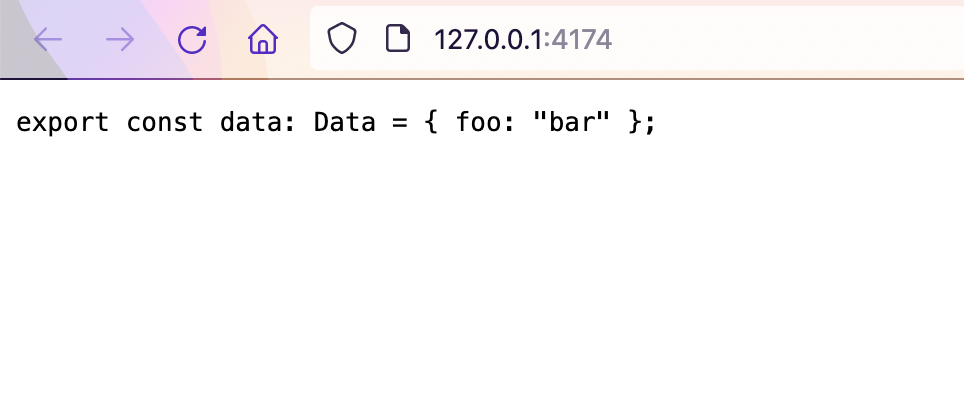
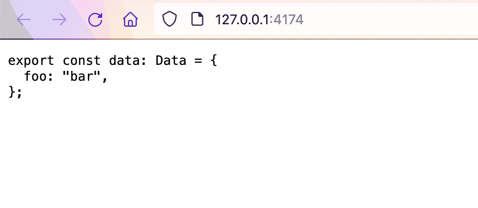

# Vite 3 + Prettier bug

This project reproduces a strange issue with production builds when using Prettier in the browser with Vite 3.

Run `pnpm install` to install dependencies.

If you run `pnpm dev`, you will notice the code is indented across several lines:

If you run `pnpm build && pnpm preview` on the other hand, the code is formatted across a single line:

This bug does not occur when downgrading to Vite 2.9.14:

